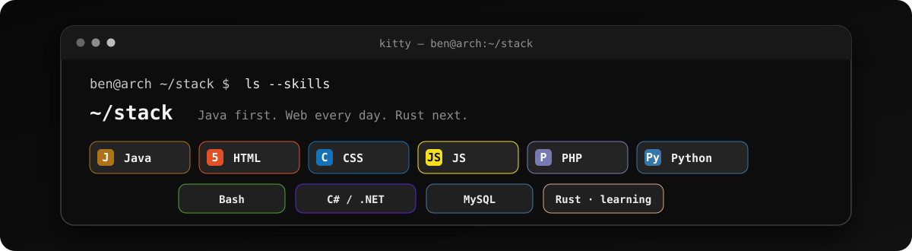
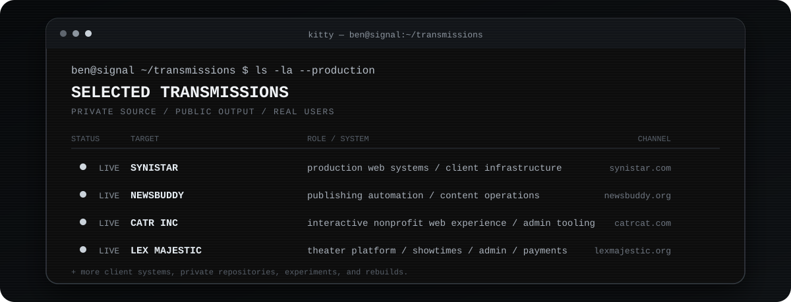
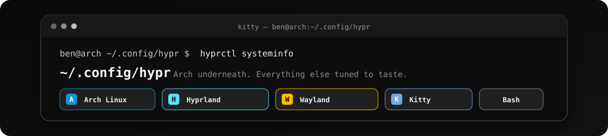
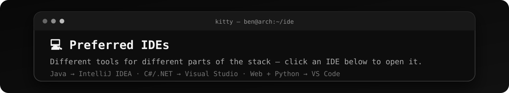
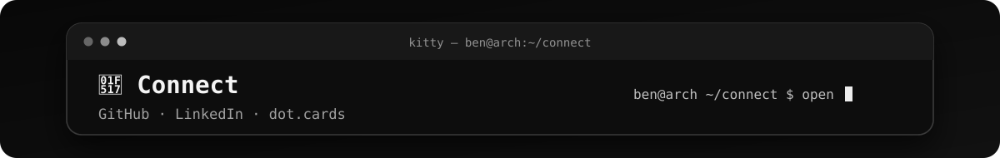
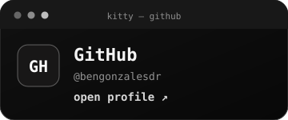
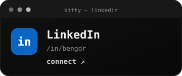
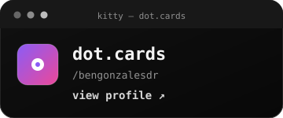
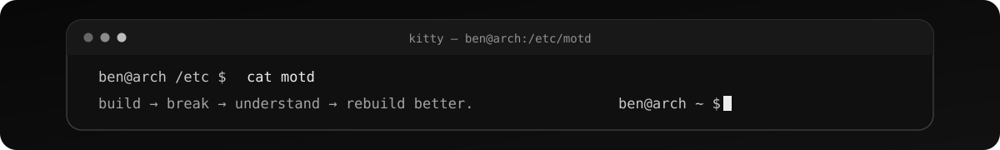

<!--
  PROFILE://BENGONZALESDR
  THEME::NOCTURNE
  MODE::SIGNAL TERMINAL
-->

<div align="center">
  
  <br><br>
  
</div>

<br>

### `00 / WHOAMI`

```text
ben@signal:~$ whoami
Benjamin Gonzales
web engineer / software developer / terminal dweller
```

I build and maintain **production web systems through Synistar**, then spend the rest of my time moving between Java, .NET, databases, Linux, and whatever I am currently taking apart to understand better.

I like software that feels **deliberate, inspectable, and useful**. I would rather understand the machinery underneath the interface than treat the stack as a black box.

<details>
<summary><code>cat ~/.profile</code></summary>
<br>

```ini
[identity]
mode = builder
bias = useful-software
interface = dark

[work]
channel = Synistar
focus = production-web-systems

[stack]
primary = Java, Web
active = C#/.NET, SQL, Linux
next = Rust

[defaults]
prefer = inspectable, customizable, self-hostable
avoid = unexplained-magic
```

</details>

---

### `01 / ~/stack`

<div align="center">
  
</div>

<details>
<summary><code>open package-cache</code></summary>
<br>
<div align="center">
  
</div>
</details>

---

### `02 / ~/transmissions`

<div align="center">
  
</div>

<div align="center">
  <code>ROUTES //</code>
  <a href="https://synistar.com">SYNISTAR</a> ·
  <a href="https://www.newsbuddy.org">NEWSBUDDY</a> ·
  <a href="https://catrcat.com">CATR</a> ·
  <a href="https://lexmajestic.org">LEX MAJESTIC</a> ·
  <a href="https://www.blingedbybrina.com">BLINGED BY BRINA</a> ·
  <a href="https://www.fraeinc.com">FRAE INC</a>
</div>

<br>

<sub>Most production/client source stays private. The output is public.</sub>

---

### `03 / /proc/github`

<div align="center">
<table>
<tr>
<td width="50%" valign="top">
  
</td>
<td width="50%" valign="top">
  
</td>
</tr>
</table>
</div>

<div align="center">
  
</div>

<div align="center">
  <sub>CONTRIBUTION SIGNAL // GENERATED DAILY</sub>
  <br><br>
  <picture>
    <source media="(prefers-color-scheme: dark)" srcset="https://raw.githubusercontent.com/bengonzalesdr/bengonzalesdr/output/github-snake-dark.svg" />
    <source media="(prefers-color-scheme: light)" srcset="https://raw.githubusercontent.com/bengonzalesdr/bengonzalesdr/output/github-snake.svg" />
    
  </picture>
</div>

---

### `04 / ~/.config/system`

<div align="center">
  
</div>

```text
OS        Omarchy / Arch Linux
COMPOSITOR Hyprland + Wayland
TERMINAL  Kitty
EDITOR    task-dependent, never ideological
METHOD    build -> break -> understand -> rebuild
```

---

### `05 / ~/ide`

<div align="center">
  
</div>

<div align="center">
  <a href="https://www.jetbrains.com/idea/"><kbd> IntelliJ IDEA </kbd></a>
  &nbsp;
  <a href="https://visualstudio.microsoft.com/"><kbd> Visual Studio </kbd></a>
  &nbsp;
  <a href="https://www.jetbrains.com/datagrip/"><kbd> DataGrip </kbd></a>
  &nbsp;
  <a href="https://code.visualstudio.com/"><kbd> VS Code </kbd></a>
</div>

---

### `06 / ~/connect`

<div align="center">
  
</div>

<p align="center">
  <a href="https://github.com/bengonzalesdr"></a>
  <a href="https://www.linkedin.com/in/bengdr/"></a>
  <a href="https://dot.cards/bengonzalesdr"></a>
</p>

---

<div align="center">
  
</div>

<div align="center">
  <sub><code>SESSION END // SIGNAL REMAINS</code></sub>
</div>
