<div align="center">



<br>

<a href="https://github.com/bengonzalesdr"><kbd>GitHub ↗</kbd></a>&nbsp;
<a href="https://www.linkedin.com/in/bengdr/"><kbd>LinkedIn ↗</kbd></a>&nbsp;
<a href="https://dot.cards/bengonzalesdr"><kbd>dot.cards ↗</kbd></a>

<br><br>

<sub><strong>JAVA</strong> &nbsp;·&nbsp; WEB DEVELOPMENT &nbsp;·&nbsp; LINUX &nbsp;·&nbsp; SYSTEMS</sub>

</div>

<br>

<table>
<tr>
<td width="62%" valign="top">

## 01 // PROFILE

I build software for the web, spend a lot of time in Linux, and like understanding what is happening underneath the abstraction.

**Java is my main language.** Web development is my everyday workflow, while Linux and the home lab are where I get closer to the systems underneath it all.

</td>
<td width="38%" valign="top">

## STATUS

**main** &nbsp; `Java`  
**working in** &nbsp; `Web`  
**daily system** &nbsp; `Arch Linux`  
**learning next** &nbsp; `Rust`  
**lab** &nbsp; `Proxmox + Docker`

</td>
</tr>
</table>

<br>

## 02 // TOOLBOX

### `LANGUAGES`

`☕ Java` &nbsp; `HTML` &nbsp; `CSS` &nbsp; `JavaScript` &nbsp; `PHP` &nbsp; `Python` &nbsp; `C# / .NET` &nbsp; `SQL / MySQL`

### `SYSTEMS + TOOLS`

`Arch Linux` &nbsp; `Linux` &nbsp; `Hyprland` &nbsp; `Wayland` &nbsp; `Kitty` &nbsp; `Bash` &nbsp; `Git` &nbsp; `GitHub` &nbsp; `Docker` &nbsp; `Proxmox`

> **NEXT UP //** 🦀 `Rust`

<br>

## 03 // WORKSPACE

<table>
<tr>
<th align="left">IDE</th>
<th align="left">LANGUAGE / WORKFLOW</th>
</tr>
<tr>
<td><a href="https://www.jetbrains.com/idea/"><strong>IntelliJ IDEA ↗</strong></a></td>
<td><code>Java</code></td>
</tr>
<tr>
<td><a href="https://visualstudio.microsoft.com/"><strong>Visual Studio ↗</strong></a></td>
<td><code>C# / .NET</code></td>
</tr>
<tr>
<td><a href="https://www.jetbrains.com/datagrip/"><strong>DataGrip ↗</strong></a></td>
<td><code>SQL / MySQL</code></td>
</tr>
<tr>
<td><a href="https://code.visualstudio.com/"><strong>VS Code ↗</strong></a></td>
<td><code>HTML · CSS · JavaScript · PHP · Python</code></td>
</tr>
</table>

<br>

## 04 // SYSTEM

```text
╭─ environment ─────────────────────────────────────────────╮
│ OS          Arch Linux                                   │
│ BASE        Omarchy — heavily re-opinionated             │
│ COMPOSITOR  Hyprland                                     │
│ DISPLAY     Wayland                                      │
│ TERMINAL    Kitty                                        │
╰───────────────────────────────────────────────────────────╯
```

My setup starts with good defaults and gets changed until it fits the way I actually work.

<br>

## 05 // HOME LAB

```text
╭─ lab ─────────────────────────────────────────────────────╮
│ NODE        BeeLink mini PC                              │
│ PLATFORM    Proxmox                                      │
│ WORKLOADS   Docker · Linux virtual machines              │
│ NETWORK     TCP/IP · DNS · DHCP                          │
│ PURPOSE     virtualization · containers · networking     │
╰───────────────────────────────────────────────────────────╯
```

The lab is where I stop treating infrastructure like magic and start taking it apart until it makes sense.

<br>

---

<div align="center">

### `BUILD → BREAK → UNDERSTAND → REBUILD BETTER`

<sub>software / web / linux / systems</sub>

<br><br>

<a href="https://github.com/bengonzalesdr"><kbd>github.com/bengonzalesdr</kbd></a>&nbsp;
<a href="https://www.linkedin.com/in/bengdr/"><kbd>linkedin.com/in/bengdr</kbd></a>&nbsp;
<a href="https://dot.cards/bengonzalesdr"><kbd>dot.cards/bengonzalesdr</kbd></a>

</div>
