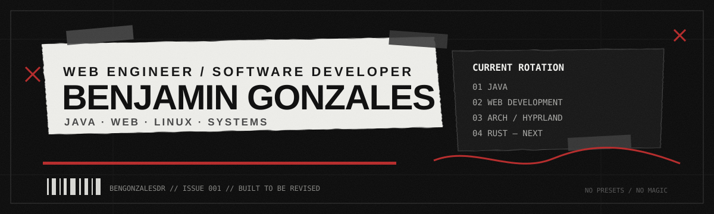

 

  

<strong>WEB ENGINEER</strong> · SOFTWARE DEVELOPER · LINUX ENTHUSIAST

 

> ### *build things. break things. understand them. rebuild them better.*
> Java is my main language. The web is where I build most often. Linux is where I go when I want to understand what is actually happening underneath it all.

---

## ✦ about

I build software for the web, spend a lot of time in Linux, and care about the part of development that happens **below the abstraction**.

My main language is **Java**. My everyday web stack is **HTML, CSS, JavaScript, and PHP**, with **Python** mostly used for scripting and tooling. I also work with **C# / .NET** and **MySQL**, and **Rust** is next on the list.

---

## ✦ stack

LANGUAGES / WEB / DATA

  
  
  
  
  
  
  
  

SYSTEMS / TOOLING

  
  
  
  
  
  
  
  

> 🦀 **currently learning:** `Rust`

---

## ✦ preferred workspace

<table>
<tr>
<td width="50%" valign="top">

**Java**  
Primary IDE for Java development.

</td>
<td width="50%" valign="top">

**C# / .NET**  
My preferred environment for .NET work.

</td>
</tr>
<tr>
<td width="50%" valign="top">

**SQL / MySQL**  
Database work and query development.

</td>
<td width="50%" valign="top">

**HTML · CSS · JavaScript · PHP · Python**  
Web work, scripting, and smaller edits.

</td>
</tr>
</table>

---

## ✦ system

**ARCH LINUX** — daily OS  
**OMARCHY** — starting point, heavily re-opinionated  
**HYPRLAND** — compositor  
**WAYLAND** — display stack  
**KITTY** — terminal

good defaults are useful. keeping them untouched is optional.

---

## ✦ home lab

**MINI PC** — lab node  
**PROXMOX** — virtualization  
**DOCKER** — containers  
**LINUX VMs** — experimentation and systems work  
**TCP/IP · DNS · DHCP** — networking fundamentals

The point of the lab is simple: stop treating infrastructure like magic.

---

### ✕ `JAVA / WEB / LINUX / SYSTEMS` ✕

built to be revised.

  

<a href="https://github.com/bengonzalesdr">GitHub</a> &nbsp;·&nbsp;
<a href="https://www.linkedin.com/in/bengdr/">LinkedIn</a> &nbsp;·&nbsp;
<a href="https://dot.cards/bengonzalesdr">dot.cards</a>

